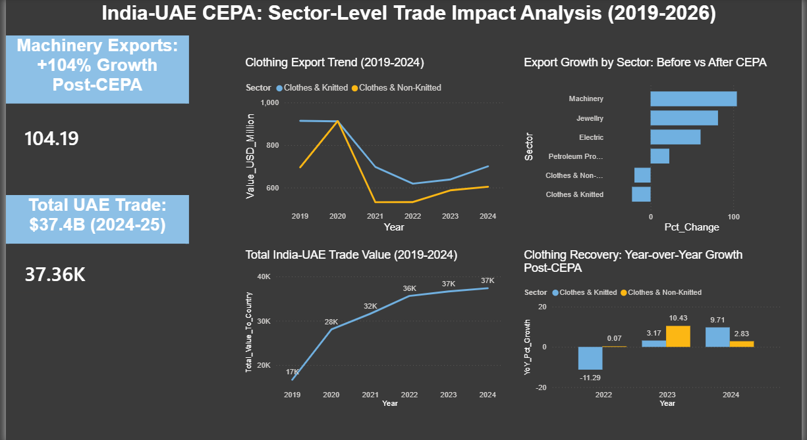

# india-uae-cepa-trade-analysis
Sector-level trade impact analysis of India-UAE CEPA using SQL, Excel, and Power BI
India-UAE CEPA: Sector-Level Trade Impact Analysis (2019-2026)
Why This Matters
Free Trade Agreements are frequently championed as unambiguous economic wins, but their real-world impact often varies significantly by sector. This analysis tests that assumption directly — examining whether India's Comprehensive Economic Partnership Agreement (CEPA) with the UAE, in force since May 2022, actually shifted trade patterns across six major sectors, and where its benefits were uneven.
UAE was selected as the case study for practical, defensible reasons: its CEPA with India (2022) is recent enough for a clean before/after comparison, UAE ranks among India's top 3-4 trading partners, and it is India's first major FTA in the Middle East region — making it a well-documented case with independent reporting available for cross-validation, which this analysis makes direct use of
Executive Summary
Using six years of government trade data across six major HS code sectors, this project evaluates CEPA's impact on India-UAE trade. Most tracked sectors show strong export growth following CEPA's implementation. One sector — clothing — appeared to show a decline under a simple before/after comparison; further investigation revealed this was a statistical artifact of an inflated pre-CEPA baseline, not a genuine downturn, once corroborated against external industry reporting.
Key Findings
•	Machinery led all sectors in export growth, rising 104% when comparing average pre-CEPA (2019-22) to post-CEPA (2022-25) export values — from $899M to $1,836M.
•	Jewelry remains India's largest export category to the UAE by absolute value, growing 81% (exports: $4,500M → $8,163M) and 87% (imports: $11,047M → $20,660M) — consistent with UAE hosting India's most significant gems and jewelry trade relationship.
•	Electrical goods and petroleum products also grew substantially post-CEPA (+60% and +23% respectively for exports), reinforcing a broad-based, multi-sector growth pattern.
•	Total India-UAE trade grew from ~$28.0B (2021-22) to ~$37.4B (2024-25) — independently confirmed against external industry reporting on CEPA's four-year impact, validating the underlying dataset's accuracy.
•	The clothing sector is highlighted below not for its economic scale — it is the smallest of the six tracked sectors — but because it produced the project's most analytically significant finding: a case where a standard methodology gave a misleading answer, requiring deeper investigation to resolve.
•	Clothing exports initially appeared to decline (~-20%) in a simple 3-year-average before/after comparison. Investigation of the year-by-year trend revealed this was driven by an anomalously high 2019-21 baseline (likely a pre/early-COVID trade pattern), not a genuine CEPA-related downturn. Within the post-CEPA period itself (2022-23 to 2024-25), both clothing sub-sectors grew consistently — Knitted apparel by +9.71% and Non-Knitted by +2.83% in the most recent year alone — a pattern consistent with external industry reports describing textiles as one of CEPA's stronger-performing sectors.
Dashboard
 
Methodology
Data was sourced from India's Ministry of Commerce Export-Import Data Bank (EIDB) across six HS code sectors — petroleum products, gems & jewelry, knitted apparel, non-knitted apparel, machinery, and electrical goods — covering both imports and exports from 2019-20 through 2025-26. Data was cleaned and queried using SQL (SQLite), including conditional aggregation to compute matched before/after CEPA averages and window functions to compute year-over-year growth trends. Findings were cross-validated against independent industry reporting on CEPA's four-year impact and visualized in an interactive Power BI dashboard.
Data Sources
•	Ministry of Commerce & Industry, Export-Import Data Bank (EIDB) — sector-wise, country-specific trade values (HS Codes 27, 71, 61, 62, 84, 85)
•	Independent verification: industry and government reporting on CEPA's four-year impact (IBEF, CEPA Council four-year impact report)
Limitations & Open Questions
•	Export data is only available through 2024-25, one year behind import data (2025-26); all before/after comparisons were restricted to matched year ranges to avoid skewed conclusions.
•	The "before CEPA" baseline (2019-20 to 2021-22) includes pandemic-affected years, which may distort simple average comparisons for sectors sensitive to COVID-era disruption — as demonstrated directly by the clothing sector finding.
•	This analysis establishes correlation between CEPA's implementation and sector trade growth, not causation; other concurrent factors (global demand shifts, currency movements, broader economic recovery) likely also contributed and were not isolated in this analysis.
•	Large percentage changes in smaller-value categories (e.g., clothing imports) can appear dramatic but represent limited absolute economic significance compared to large-base sectors like jewelry and petroleum.
Implications
CEPA's benefits appear broad-based across most tracked sectors, with machinery and jewelry showing the strongest gains. However, the clothing sector's initial appearance of decline — later resolved through deeper investigation — is a useful cautionary example: simple before/after averages can mask real trends when baseline periods are unstable, underscoring the importance of examining underlying year-by-year data before drawing policy conclusions from aggregate trade statistics.
Tools Used
SQL (SQLite) · Excel · Power BI

